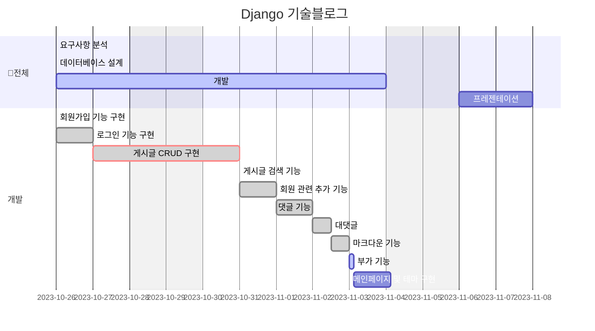
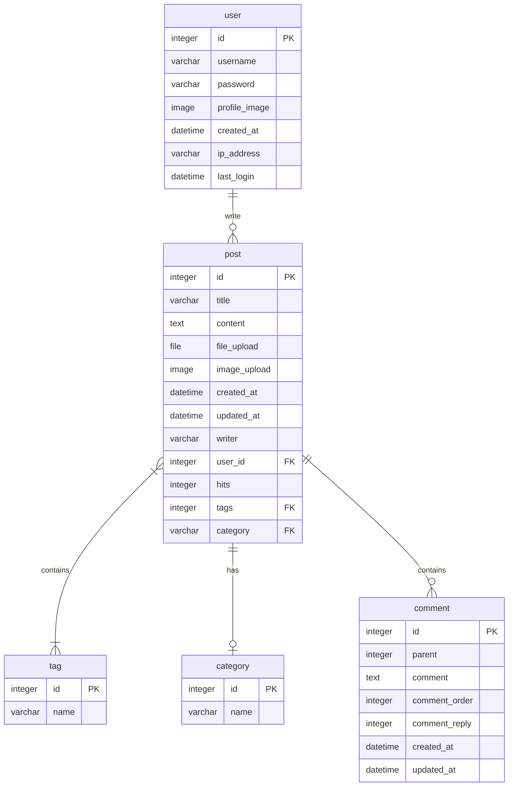

# blog_project
## 목차

1. 요구사항
2. 프로젝트 구조
3. 데이터베이스 구조
4. 기능명세서
5. 화면설계
6. 회고
---
### 요구사항명세
- 프로젝트 일정: 10월 26일(목) ~ 11월 7일(화)
- 11월 8일 개별 발표(개인당 5분)
- 기술 blog 만들기
- 모놀리식 (DRF는 이 프로젝트에서 사용하지 않습니다.)
- 데이터베이스 구조를 설계
1. 메인페이지 구현
    - 페이지 제목과 블로그 입장하기 버튼이 있습니다.
    - 회원가입/로그인 버튼이 있습니다.
    - 회원가입 버튼을 클릭하면 회원가입 페이지로 이동합니다.
    - 로그인 버튼을 클릭하면 로그인 페이지로 이동합니다.
2. 회원가입 기능 구현
    - 회원가입을 할 수 있는 페이지가 있어야합니다.
    - 입력받는 값은 id, password입니다.
3. 로그인 기능 구현
    - 로그인을 할 수 있는 페이지가 있어야합니다.
    - 입력받는 값은 id, password입니다.
4. **게시글 작성 기능 구현**
    - 로그인을 한 유저만 해당 기능을 사용 할 수 있습니다.
    - 게시글 제목과 내용을 작성 할 수 있는 페이지가 있어야합니다.
    - 작성한 게시글이 저장되어 게시글 목록에 보여야 합니다.
    - **사진 업로드가 가능하도록 합니다.**
    - **게시글 조회수가 올라갈 수 있도록 합니다.**
5. 게시글 목록 기능 구현
    - 모든 사용자들이 게시한 블로그 게시글들의 제목을 확인 할 수 있습니다.
6. 게시글 상세보기 기능 구현
    - 게시글의 제목/내용을 보는 기능입니다.
7. 게시글 검색 기능 구현
    - 주제와 태그에 따라 검색이 가능하게 합니다.
    - 검색한 게시물은 시간순에 따라 정렬이 가능해야 합니다.
8. 게시글 수정 기능 구현
    - 로그인을 한 유저만 해당 기능을 사용 할 수 있습니다.
    - 본인의 게시글이 아니라면 수정이 불가능합니다.
    - 게시글의 제목 또는 내용을 수정 하는 기능입니다.
    - 게시글 제목과 내용을 수정 할 수 있는 페이지가 있어야합니다.
    - 수정된 내용은 게시글 목록보기/상세보기에 반영되어야합니다.
9. 게시글 삭제 기능 구현
    - 로그인을 한 유저만 해당 기능을 사용 할 수 있습니다.
    - 본인의 게시글이 아니라면 수정이 불가능합니다.
    - 게시글을 삭제하는 기능입니다.
    - 삭제를 완료한 이후에 게시글 목록 화면으로 돌아갑니다.
    - 삭제된 게시글은 게시글 목록보기/상세보기에서 접근이 불가능하며,
    접근 시도 시 <존재하지 않는 게시글입니다> 라는 페이지를 보여줍니다.
10. **회원 관련 추가 기능(UI 직접 구현 필요)**
    - 비밀번호 변경기능
    - 프로필 수정
    - 닉네임 추가
11. **댓글 기능(UI 직접 구현 필요)**
    - 댓글 추가
    - 댓글 삭제
    - 대댓글
    - disqus와 같은 솔루션 서비스를 사용하시면 안됩니다.
        - 가산점만 안될 뿐이지 완성도를 위해 추가하는 것은 괜찮습니다.
12. 부가 기능
    - 정적 파일 모으기 (collectstatic)
    - 번역 기능 (en, kr)
13. **(선택) AWS Lightsail로 배포합니다.**
    - 해당 과제는 개인에게 비용이 청구될 수 있습니다. 따라서 선택사항이지만 꼭 배포하여 운영까지 해보시는 것을 권해드립니다.
---
### WBS

---
### 프로젝트 구조
---
### 데이터베이스 구조

---
### 기능명세서
---
### 화면 설계
---
