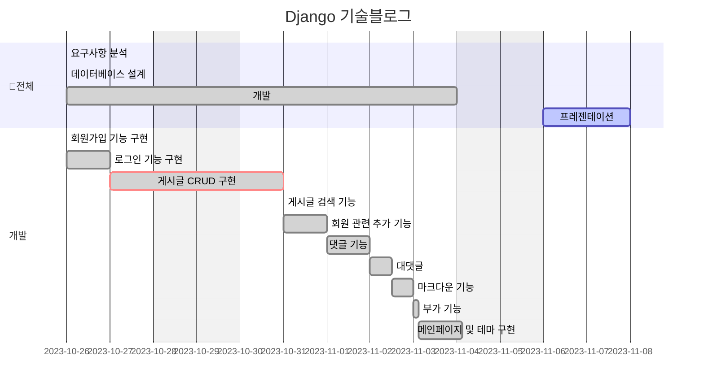
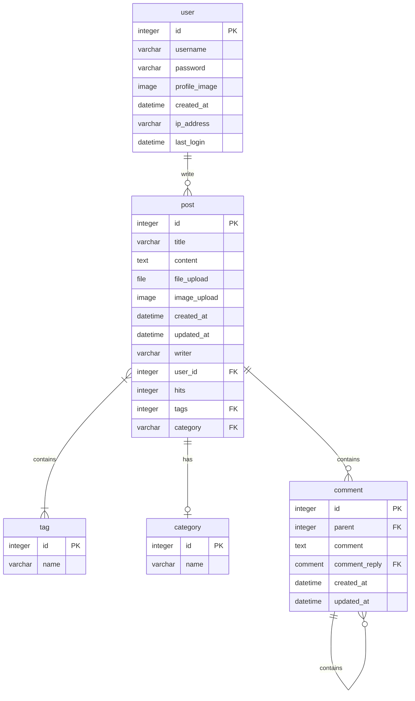

# blog_project
## 목차

1. 요구사항
2. 프로젝트 구조
3. 데이터베이스 구조
4. 기능명세서
5. 화면설계
6. 회고
---
### 요구사항명세
- 프로젝트 일정: 10월 26일(목) ~ 11월 7일(화)
- 11월 8일 개별 발표(개인당 5분)
- 기술 blog 만들기
- 모놀리식 (DRF는 이 프로젝트에서 사용하지 않습니다.)
- 데이터베이스 구조를 설계

* 사용언어

Python
* 프레임워크

Django, Bootstrap, Bootstrap_icon
* 배포

[PC](http://125.247.185.94:8000/blog)
서버는 23.11.08 이후로 내립니다.

---
<details>
<summary>1. 메인페이지 구현</summary>
- 페이지 제목과 블로그 입장하기 버튼이 있습니다.<br>
- 회원가입/로그인 버튼이 있습니다.<br>
- 회원가입 버튼을 클릭하면 회원가입 페이지로 이동합니다.<br>
- 로그인 버튼을 클릭하면 로그인 페이지로 이동합니다.<br>
</details>
<details>
<summary>2. 회원가입 기능 구현</summary>
- 회원가입을 할 수 있는 페이지가 있어야합니다.<br>
- 입력받는 값은 id, password입니다.<br>
</details>
<details>
<summary>3. 로그인 기능 구현</summary>
- 로그인을 할 수 있는 페이지가 있어야합니다.<br>
- 입력받는 값은 id, password입니다.<br>
</details>
<details>
<summary>4. 게시글 작성 기능 구현</summary>
- 로그인을 한 유저만 해당 기능을 사용 할 수 있습니다.<br>
- 게시글 제목과 내용을 작성 할 수 있는 페이지가 있어야합니다.<br>
- 작성한 게시글이 저장되어 게시글 목록에 보여야 합니다.<br>
- 사진 업로드가 가능하도록 합니다.<br>
- 게시글 조회수가 올라갈 수 있도록 합니다.<br>
</details>
<details>
<summary>5. 게시글 목록 기능 구현</summary>
- 모든 사용자들이 게시한 블로그 게시글들의 제목을 확인 할 수 있습니다.
</details>
<details>
<summary>6. 게시글 상세보기 기능 구현</summary>
- 게시글의 제목/내용을 보는 기능입니다.
</details>
<details>
<summary>7. 게시글 검색 기능 구현</summary>
- 주제와 태그에 따라 검색이 가능하게 합니다.<br>
- 검색한 게시물은 시간순에 따라 정렬이 가능해야 합니다.<br>
</details>
<details>
<summary>8. 게시글 수정 기능 구현</summary>
- 로그인을 한 유저만 해당 기능을 사용 할 수 있습니다.<br>
- 본인의 게시글이 아니라면 수정이 불가능합니다.<br>
- 게시글의 제목 또는 내용을 수정 하는 기능입니다.<br>
- 게시글 제목과 내용을 수정 할 수 있는 페이지가 있어야합니다.<br>
- 수정된 내용은 게시글 목록보기/상세보기에 반영되어야합니다.<br>
</details>

<details>
<summary>9. 게시글 삭제 기능 구현</summary>
- 로그인을 한 유저만 해당 기능을 사용 할 수 있습니다.<br>
- 본인의 게시글이 아니라면 수정이 불가능합니다.<br>
- 게시글을 삭제하는 기능입니다.<br>
- 삭제를 완료한 이후에 게시글 목록 화면으로 돌아갑니다.<br>
- 삭제된 게시글은 게시글 목록보기/상세보기에서 접근이 불가능하며,<br>
접근 시도 시 '존재하지 않는 게시글입니다' 라는 페이지를 보여줍니다.<br>
</details>

<details>
<summary>10. 회원 관련 추가 기능(UI 직접 구현 필요)</summary>
    - 비밀번호 변경기능<br>
    - 프로필 수정<br>
    - 닉네임 추가<br>
</details>

<details>
<summary>11. 댓글 기능(UI 직접 구현 필요)</summary>
- 댓글 추가<br>
- 댓글 삭제<br>
- 대댓글<br>
</details>

<details>
<summary>12. 부가 기능</summary>
- 번역 기능 (en, kr)
</details>
    
### WBS

---
### 프로젝트 구조
<details>
<summary>펼치기</summary>

```sh
tutorialproject
 ┣ accounts
 ┃ ┣ migrations
 ┃ ┃ ┣ 0001_initial.py
 ┃ ┃ ┣ 0002_alter_user_profile_image.py
 ┃ ┃ ┣ 0003_remove_user_username.py
 ┃ ┃ ┣ 0004_alter_user_ip_address.py
 ┃ ┃ ┣ 0005_user_username.py
 ┃ ┃ ┣ 0006_alter_user_email_alter_user_password_and_more.py
 ┃ ┃ ┣ 0007_alter_user_email_alter_user_last_login_and_more.py
 ┃ ┃ ┣ 0008_alter_user_profile_image.py
 ┃ ┃ ┗ __init__.py
 ┃ ┣ templates
 ┃ ┃ ┗ accounts
 ┃ ┃ ┃ ┣ base.html
 ┃ ┃ ┃ ┣ join.html
 ┃ ┃ ┃ ┣ login.html
 ┃ ┃ ┃ ┣ password_change.html
 ┃ ┃ ┃ ┣ password_change_done.html
 ┃ ┃ ┃ ┗ profile.html
 ┃ ┣ __init__.py
 ┃ ┣ admin.py
 ┃ ┣ apps.py
 ┃ ┣ forms.py
 ┃ ┣ models.py
 ┃ ┣ tests.py
 ┃ ┣ urls.py
 ┃ ┗ views.py
 ┣ blog
 ┃ ┣ migrations
 ┃ ┃ ┣ 0001_initial.py
 ┃ ┃ ┣ 0002_category_tag_rename_contents_post_content_and_more.py
 ┃ ┃ ┣ 0003_post_user.py
 ┃ ┃ ┣ 0004_remove_post_writer.py
 ┃ ┃ ┣ 0005_alter_comment_comment_reply.py
 ┃ ┃ ┣ 0006_alter_comment_comment_reply_alter_post_content.py
 ┃ ┃ ┗ __init__.py
 ┃ ┣ templates
 ┃ ┃ ┗ blog
 ┃ ┃ ┃ ┣ base.html
 ┃ ┃ ┃ ┣ chat.html
 ┃ ┃ ┃ ┣ comment_form.html
 ┃ ┃ ┃ ┣ post_confirm_delete.html
 ┃ ┃ ┃ ┣ post_detail.html
 ┃ ┃ ┃ ┣ post_form.html
 ┃ ┃ ┃ ┣ post_list.html
 ┃ ┃ ┃ ┗ recursive_comment.html
 ┃ ┣ __init__.py
 ┃ ┣ admin.py
 ┃ ┣ apps.py
 ┃ ┣ forms.py
 ┃ ┣ models.py
 ┃ ┣ tests.py
 ┃ ┣ urls.py
 ┃ ┗ views.py
 ┣ django_tuieditor
 ┃ ┣ static
 ┃ ┣ templates
 ┃ ┃ ┗ django_tuieditor
 ┃ ┃ ┃ ┣ editor.html
 ┃ ┃ ┃ ┣ static_viewer.html
 ┃ ┃ ┃ ┗ viewer.html
 ┃ ┣ templatetags
 ┃ ┃ ┣ __init__.py
 ┃ ┃ ┣ gfm.py
 ┃ ┃ ┗ render_widget.py
 ┃ ┣ __init__.py
 ┃ ┣ apps.py
 ┃ ┣ fields.py
 ┃ ┣ models.py
 ┃ ┗ widgets.py
 ┣ locale
 ┃ ┣ en
 ┃ ┃ ┗ LC_MESSAGES
 ┃ ┃ ┃ ┣ django.mo
 ┃ ┃ ┃ ┗ django.po
 ┃ ┗ ko
 ┃ ┃ ┗ LC_MESSAGES
 ┃ ┃ ┃ ┣ django.mo
 ┃ ┃ ┃ ┗ django.po
 ┣ main
 ┃ ┣ migrations
 ┃ ┃ ┗ __init__.py
 ┃ ┣ templates
 ┃ ┃ ┗ main
 ┃ ┃ ┃ ┗ index.html
 ┃ ┣ __init__.py
 ┃ ┣ admin.py
 ┃ ┣ apps.py
 ┃ ┣ models.py
 ┃ ┣ tests.py
 ┃ ┣ urls.py
 ┃ ┗ views.py
 ┣ media
 ┃ ┣ account
 ┃ ┃ ┗ 2023
 ┃ ┃ ┃ ┣ 10
 ┃ ┃ ┃ ┃ ┣ 27
 ┃ ┃ ┃ ┃ ┃ ┣ Untitled.png
 ┃ ┃ ┃ ┃ ┃ ┗ Untitled_TOFcrAA.png
 ┃ ┃ ┃ ┃ ┗ 31
 ┃ ┃ ┃ ┃ ┃ ┣ jiman.jpg
 ┃ ┃ ┃ ┃ ┃ ┣ 서명.jpg
 ┃ ┃ ┃ ┃ ┃ ┗ 서명_8DVZFz8.jpg
 ┃ ┃ ┃ ┗ 11
 ┃ ┃ ┃ ┃ ┗ 07
 ┃ ┃ ┃ ┃ ┃ ┗ sample_images_08.png
 ┃ ┣ blog
 ┃ ┃ ┗ 2023
 ┃ ┃ ┃ ┣ 10
 ┃ ┃ ┃ ┃ ┗ 27
 ┃ ┃ ┃ ┃ ┃ ┣ Untitled.png
 ┃ ┃ ┃ ┃ ┃ ┣ Untitled_1OJwIgn.png
 ┃ ┃ ┃ ┃ ┃ ┗ Untitled_uCdv6O8.png
 ┃ ┃ ┃ ┗ 11
 ┃ ┃ ┃ ┃ ┣ 06
 ┃ ┃ ┃ ┃ ┃ ┗ 서명.jpg
 ┃ ┃ ┃ ┃ ┗ 07
 ┃ ┃ ┃ ┃ ┃ ┣ sample_images_01.png
 ┃ ┃ ┃ ┃ ┃ ┣ sample_images_02.png
 ┃ ┃ ┃ ┃ ┃ ┣ sample_images_03.png
 ┃ ┃ ┃ ┃ ┃ ┣ sample_images_04.png
 ┃ ┃ ┃ ┃ ┃ ┣ sample_images_05.png
 ┃ ┃ ┃ ┃ ┃ ┣ sample_images_06.png
 ┃ ┃ ┃ ┃ ┃ ┗ sample_images_07.png
 ┃ ┗ file
 ┃ ┃ ┗ 2023
 ┃ ┃ ┃ ┗ 11
 ┃ ┃ ┃ ┃ ┗ 06
 ┣ migrations
 ┃ ┗ __init__.py
 ┣ static
 ┃ ┣ css
 ┃ ┃ ┣ chat.css
 ┃ ┃ ┣ common.css
 ┃ ┃ ┣ list.css
 ┃ ┃ ┣ login-join.css
 ┃ ┃ ┣ table.css
 ┃ ┃ ┣ view.css
 ┃ ┃ ┗ write.css
 ┃ ┣ django_tuieditor
 ┃ ┃ ┣ codemirror.css
 ┃ ┃ ┣ codemirror.js
 ┃ ┃ ┣ django-fixes.css
 ┃ ┃ ┣ django-fixes.js
 ┃ ┃ ┣ toastui-editor-viewer.css
 ┃ ┃ ┣ toastui-editor-viewer.js
 ┃ ┃ ┣ toastui-editor.css
 ┃ ┃ ┗ toastui-editor.js
 ┃ ┗ img
 ┃ ┃ ┣ default_user.jpg
 ┃ ┃ ┣ est.jpg
 ┃ ┃ ┣ first.png
 ┃ ┃ ┣ icon-search.png
 ┃ ┃ ┣ icon-x.png
 ┃ ┃ ┣ last.png
 ┃ ┃ ┣ licat.png
 ┃ ┃ ┣ next.png
 ┃ ┃ ┗ prev.png
 ┣ tutorialproject
 ┃ ┣ __init__.py
 ┃ ┣ asgi.py
 ┃ ┣ settings.py
 ┃ ┣ urls.py
 ┃ ┗ wsgi.py
 ┣ __init__.py
 ┣ admin.py
 ┣ apps.py
 ┣ db.sqlite3
 ┣ manage.py
 ┣ models.py
 ┣ nohup.out
 ┣ requirements.txt
 ┣ tests.py
 ┗ views.py
```
</details>

- 4가지의 커스텀 앱과 2개의 외부 라이브러리를 사용합니다.
```python
INSTALLED_APPS = [
    ...
    # 커스텀 앱
    'blog.apps.BlogConfig',
    'accounts.apps.AccountsConfig',
    'main.apps.MainConfig',
    'django_tuieditor.apps.DjangoTUIEditorConfig',
    # 외부 라이브러리
    'bootstrap5',
    'django_bootstrap_icons',
]

```
- urls.py
```python
urlpatterns = [
    path('admin/', admin.site.urls),
    path('', include('main.urls')),
    path('blog/', include('blog.urls')),
    path('accounts/', include('accounts.urls')),
    path('i18n/', include('django.conf.urls.i18n')),
]
```

---
### 데이터베이스 구조

- python modeling
```python
class Category(models.Model):
  name = models.CharField(max_length=100, unique=True)
    
class Tag(models.Model):
  name = models.CharField(max_length=100, unique=True)
    
class Post(BaseModel):
  title = models.CharField(max_length=100)
  content = MarkdownField()
  image_upload = models.ImageField(verbose_name='이미지',upload_to='blog/%Y/%m/%d/', blank=True, null=True)
  file_upload = models.FileField(verbose_name='파일',upload_to='file/%Y/%m/%d/', blank=True, null=True)
  created_at = models.DateTimeField(auto_now_add=True)
  updated_at = models.DateTimeField(auto_now=True)
  user = models.ForeignKey(User, on_delete=models.CASCADE, default='')
  hits = models.IntegerField(default=0)
  category = models.ForeignKey(Category, blank=True, null=True ,on_delete=models.CASCADE)
  tags = models.ManyToManyField(Tag, blank=True)

class Comment(models.Model):
  post = models.ForeignKey(Post, on_delete=models.CASCADE)
  comment_reply = models.ForeignKey('self', null=True, blank=True, on_delete=models.CASCADE, related_name='replies')
  comment_order = models.IntegerField(null=True, blank=True)
  user = models.ForeignKey(User, on_delete=models.CASCADE)
  content = models.TextField()
  created_at = models.DateTimeField(auto_now_add=True)
  updated_at = models.DateField(auto_now=True)


```

---
### 기능명세서
- CBV(Class Based View)로 작성되었습니다.
### PageTitleViewMixin: 공통 상속 클래스
- 페이지의 제목을 나타내는 클래스를 만들고 모든 View가 상속하도록 했습니다.
```python
class PageTitleViewMixin:
  title = ""

  def get_title(self):
    return self.title
  def get_context_data(self, **kwargs):
    context = super().get_context_data(**kwargs)
    context['title'] = self.get_title()
    return context
```

### BoardList(PageTitleViewMixin, ListView): 
- 작성된 글의 리스트화면 입니다.
- 페이지네이션, 검색, 삭제(관리자) 기능이 있습니다.


### BoardWrite(PageTitleViewMixin, PermissionRequiredMixin, CreateView):
- 글 쓰기 화면 입니다.
- 쓰기 권한을 검사합니다.
- Toast-Ui-Editor 폼양식을 사용합니다.

### BoardUpdate(PageTitleViewMixin, PermissionRequiredMixin, UpdateView):
- 글 수정 화면입니다.
- 수정 권한을 검사합니다.

### BoardView(PageTitleViewMixin, DetailView):
- 글 상세보기 화면 입니다.
- Toast-Ui-Editor로 작성된 글을 마크업으로 보여줍니다
- 선택한 글과 글에 달린 댓글과 대댓글을 보여줍니다.
- get 요청 시 조회수가 1 증가합니다

* comment_form.html
```html

<div class="media mb-4" id="comment_id_{{ comment.id }}">
  <div class="media-body">
    <h5>{{comment.user.get_image_tag}}<a class="btn btn-outline-success m-2" href="{{post.get_absolute_url}}?comment={{comment.id}}">Reply</a></h5>
    <h5 class="mt-0">{{comment.user}}</h5>
    <h5 class="mt-0">{{comment.created_at}}</h5>
    <h5 class="mt-0 bg-light text-body">{{comment.content}}</h5>
    
    
      <div class="ms-4">
      
      </div>
    
  
  </div>
</div>
```
* recursive_comment.html
```html
<div class="media mb-4" id="comment_id_{{ comment.id }}">
  <div class="media-body">
    <h5>{{comment.user.get_image_tag}}<a class="btn btn-outline-success m-2" href="{{post.get_absolute_url}}?comment={{comment.id}}">Reply</a></h5>
    <h5 class="mt-0">{{comment.user}}</h5>
    <h5 class="mt-0">{{comment.created_at}}</h5>
    <h5 class="mt-0 bg-light text-body">{{comment.content}}</h5>
    
      
        <div class="ms-4">
        
        </div>
      
    
  </div>
</div>
```

### BoardDelete(PageTitleViewMixin, PermissionRequiredMixin, DeleteView):
- 글 삭제 View 입니다. 삭제권한을 확인합니다.

### BoardDeleteMultiple(View):
- 선택삭제 View 입니다. 관리자권한을 확인합니다.
- post 요청 시 넘겨진 Post.id 값으로 삭제 합니다.

### JoinUser(PageTitleViewMixin, CreateView):
- 회원가입 화면 입니다.
```python
class CustomUserManager(UserManager):
    def _create_user(self, email, password, **extra_fields):
        if not email:
          raise ValueError('이메일은 필수입니다.')
        email = self.normalize_email(email)
        user = self.model(
          email = email,
          **extra_fields,
        )
        
        user.set_password(password) # Hash
        user.save(using=self._db)
        return user
```

### loginUser(PageTitleViewMixin, LoginView):
- 로그인 화면 입니다.

### ProfileUser(PageTitleViewMixin, UpdateView):
- 유저정보 화면 입니다. 로그인 권한을 검사합니다.
- 정보 수정 기능이 있습니다.

### PasswordChangeUser(PageTitleViewMixin, PasswordChangeView):
- 비밀번호 변경 화면입니다. 로그인 권한을 검사합니다.

### PasswordChangeDoneUser(PageTitleViewMixin, PasswordChangeDoneView):
- 비밀번호 변경 완료 화면입니다. 로그인 권한을 검사합니다.


---
### 화면 설계
<table>
    <tbody>
        <tr>
            <td>메인</td>
            <td>로그인</td>
        </tr>
        <tr>
            <td>
                

            </td>
            <td>
                
            </td>
        </tr>
        <tr>
            <td>회원가입</td>
            <td>정보수정</td>
        </tr>
        <tr>
            <td>
                
            </td>
            <td>
                
            </td>
        </tr>
        <tr>
            <td>검색</td>
            <td>번역</td>
        </tr>
        <tr>
            <td>
                
            </td>
            <td>
                
            </td>
        </tr>
        <tr>
            <td>선택삭제</td>
            <td>글쓰기</td>
        </tr>
        <tr>
            <td>
            </td>
            <td>
                
            </td>
        </tr>
        <tr>
            <td>글 상세보기</td>
            <td>댓글</td>
        </tr>
        <tr>
            <td>
                
            </td>
            <td>
                
            </td>
        </tr>
    </tbody>
</table>


---
### 회고
- 잘한점/기억에 남는 점

블로그를 개발해 보면서 고려했던 것들 중 첫번째가 '속도' 였습니다.

장고는 기본적으로 상속하는 클래스가 많이 있어서 CRUD에 필요한 클래스들을 익혔던 것이 기억에 남습니다.

그리고 장고는 모델에 자기 자신을 참조하는 'self' 라는 독특한 문법을 가지고 있다는 것입니다.

- 아쉬운 점

WISIWYG 에디터의 이미지를 따로 서버에 저장하는 것까지 구현하지 못한 것이 아쉽습니다.
